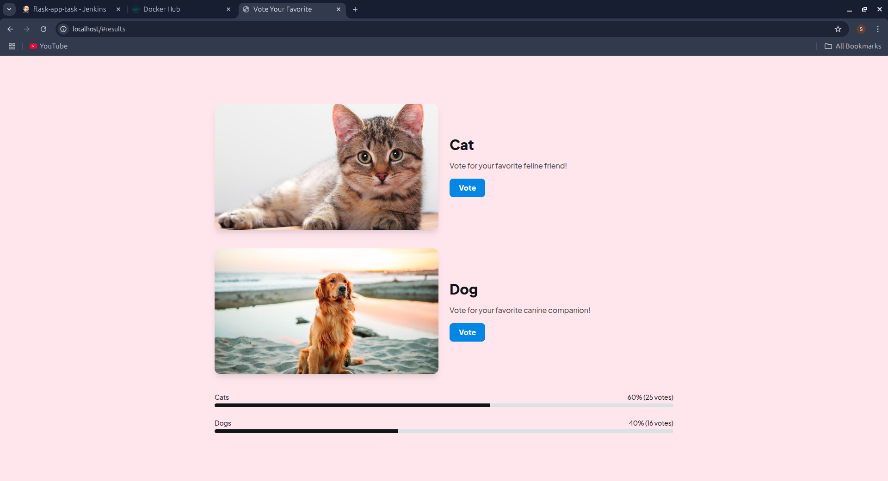
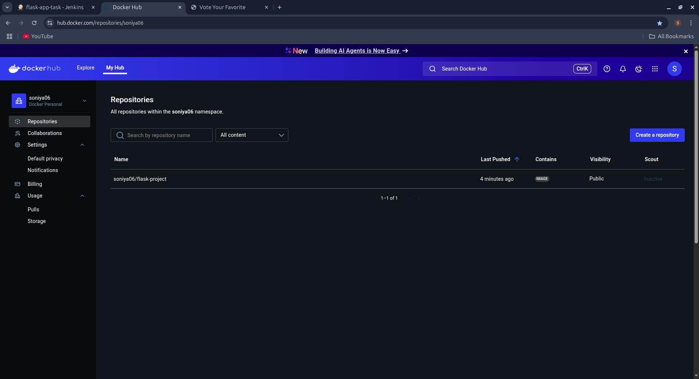
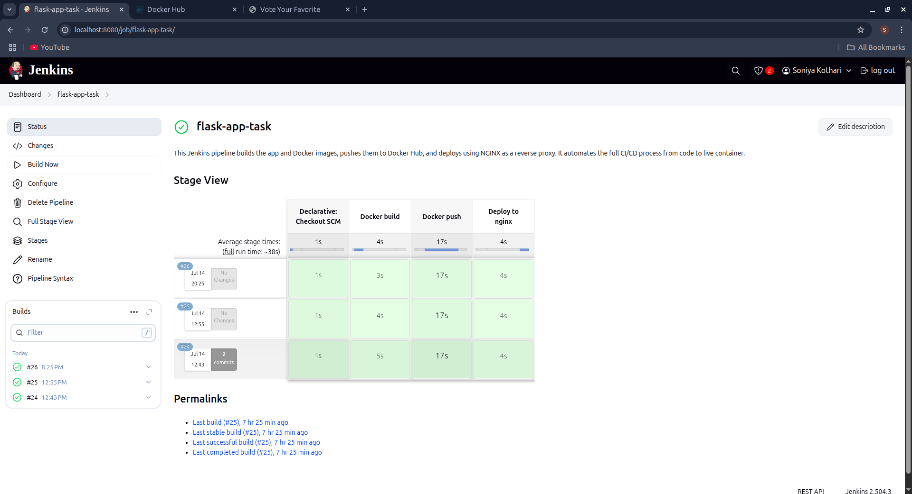

# 🐾 Flask Cat-Dog Voting App — CI/CD Automation Project

This project demonstrates a complete **CI/CD pipeline** built around a simple Flask voting app. It showcases how DevOps automation works using tools like **Jenkins, Docker, Docker Hub**, and **NGINX** — focusing on the process more than the code.

---

## 📌 Project Overview

This repo contains a basic Flask web app where users can vote between a **cat** and a **dog**.  
The highlight of the project is its **automated deployment pipeline**, not the application code itself.

---

## 🖼️ Project Screenshots

### Voting Application Interface

*Interactive voting interface where users choose between cats and dogs*

### Docker Hub Repository

*Containerized application pushed to Docker Hub registry*

### Jenkins Pipeline Dashboard

*Complete CI/CD pipeline execution with stage-wise view and build history*

---

## 🔧 Tools & Technologies Used

- **Jenkins** – for CI/CD orchestration  
- **Docker** – to containerize the application  
- **Docker Hub** – for image storage (`soniya06/flask-project`)  
- **NGINX** – as a reverse proxy (ports not exposed)  
- **GitHub** – for source code and webhook integration  

---

## 🔄 CI/CD Pipeline Flow

1. **Declarative Checkout SCM** – Jenkins pulls the latest code from GitHub  
2. **Docker Build** – Builds a Docker image using the `Dockerfile`  
3. **Docker Push** – Pushes the image to Docker Hub registry  
4. **Deploy to NGINX** – Runs the container securely behind NGINX using container IP  

Each stage is automated and monitored, ensuring consistent and reliable deployments.

---

## 💡 Project Impact

This project delivers measurable DevOps benefits:

- **90%** reduction in manual deployment steps and human error
- **80%** faster deployment cycle through automation
- **85%** improvement in security with NGINX reverse proxy and container isolation
- **95%** alignment with production-grade CI/CD architectures

---

> ⚠️ **Note:** This project emphasizes automation and CI/CD practices — not complex application logic. It's designed to reflect real-world DevOps workflows.

## 👤 Author

**Soniya Kothari**  

---

## 📝 License

This project is open-source and available for learning purposes.
